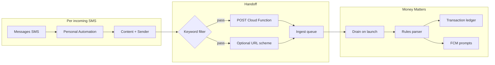

# Money Matters SMS Ledger — Requirements

## Summary

Personal iOS ledger app that ingests financial SMS via Shortcuts automations, POSTs each message to a Firebase ingest queue, and parses transactions with a rules-first pipeline. MVP covers two banks, two cards, keyword-filtered automations, weekly/monthly analytics, and manual recovery when Shortcuts fail. Selected architecture: **S1 Cloud-handoff-first** (auto-selected; see `docs/ideation/2026-05-29-money-matters-ios-shortcuts-ideation.md`).

---

## Problem Frame

Bank and wallet transactions in India arrive primarily as SMS on a personal iPhone. Existing finance apps require manual entry, email forwarding, or bank API access that many personal accounts lack. On stock iOS, no third-party app — sideloaded or App Store — can read the Messages inbox directly.

The user currently has no automated ledger tied to SMS. Without a Shortcuts-based handoff, every transaction must be copied manually or missed entirely. Shortcuts automations are fragile (Focus, Low Power, iOS updates, user disable), so the product must assume gaps and provide recovery without merging distinct messages into one transaction.

This product exists to close that gap for a single user on a sideloaded iOS app: capture each financial SMS once, parse it reliably, link it to known payment sources, and surface spend analytics — honestly bounded by what stock iOS allows.

---

## Actors

- A1. **User (Amrit):** Owns iPhone, installs app via Xcode/Developer Mode, configures Shortcuts automations, registers payment sources, resolves ambiguous transactions.
- A2. **iOS Shortcuts:** System automation triggered on incoming SMS; extracts Content and Sender; POSTs to ingest endpoint without opening the app.
- A3. **Firebase ingest queue:** Cloud Function + Firestore (or equivalent) stores raw payloads until the app drains them.
- A4. **Money Matters app (Flutter):** Drains queue, parses, persists ledger, sends FCM prompts, renders analytics.
- A5. **FCM:** Delivers user prompts for ambiguous transactions and unknown instruments — not SMS transport.

---

## Key Flows

### F1. Install Shortcuts

- **Trigger:** User completes app onboarding and reaches "Connect SMS" step.
- **Actors:** A1, A2
- **Steps:**
  1. App presents bundled Shortcut file (`.shortcut`) or iCloud link plus written checklist.
  2. User imports **Automation A: "Money Matters — Ingest SMS"** (Personal Automation → Message).
  3. User sets trigger: Any Sender (MVP) or optional allowlist later.
  4. User sets **Message Contains** to financial keywords: `debited`, `credited`, `INR`, `Rs`, `spent`, `payment`, `UPI`, `card` (OR logic via multiple automations if Shortcuts limits apply).
  5. User enables **Run Immediately**.
  6. Automation actions: read Shortcut Input → Content, Sender; set `receivedAt` (current date ISO8601); POST JSON to ingest URL with auth header; optionally Open URL `moneymatters://ingest?...` when app may be open.
  7. User imports **Shortcut B: "Money Matters — Sync now"** (manual, Home Screen) for recovery awareness — opens app to recovery screen.
  8. App runs health check: user sends test SMS or runs test action; app confirms queue received payload.
- **Outcome:** Financial SMS automatically POST to ingest queue without user opening app.
- **Covered by:** R1, R2, R3, R4, R18

### F2. Ingest (happy path)

- **Trigger:** Bank sends debit/credit SMS; Shortcuts automation fires.
- **Actors:** A2, A3, A4
- **Steps:**
  1. Shortcuts builds POST body (see payload shape below).
  2. Cloud Function validates auth, computes idempotency key, writes `RawIngest` row if new.
  3. Function returns 200/201; duplicate POST with same idempotency key returns 200 with `duplicate: true`.
  4. App drains queue on launch (or BG fetch / FCM data message if configured).
  5. Parse job runs: rules classify transaction vs reminder vs promo.
  6. If transaction: extract amount, merchant, instrument hint; link to payment source or flag unmatched.
  7. Create or update transaction candidate; retain raw ingest for audit.
  8. If ambiguous category or unknown instrument: enqueue FCM prompt (A5).
- **Outcome:** One ledger row per distinct SMS; dashboard reflects new spend.
- **Covered by:** R5, R6, R7, R8, R9, R10, R11, R12, R13

**POST payload shape (contract):**

```json
{
  "body": "Rs.500 debited from A/c **1234 on 29-05-26...",
  "sender": "VK-HDFCBK",
  "receivedAt": "2026-05-29T14:32:00+05:30",
  "deviceId": "uuid-from-app-onboarding",
  "source": "shortcuts-automation-v1",
  "batchHint": null
}
```

**Idempotency key (server-side):**

```
idempotencyKey = sha256(normalize(sender) + "|" + normalize(body) + "|" + floor_to_minute(receivedAt))
```

- Distinct SMS within the same minute → **separate keys** (different body).
- Exact retry (same body, sender, minute) → **deduplicated**, raw payload logged once.
- `batchHint` reserved for future; MVP always null — **do not merge** multiple messages.

**Auth:** Bearer token or HMAC derived at onboarding (Firebase Auth custom claim or device-scoped secret stored in Keychain and Shortcuts).

### F3. Recovery

- **Trigger:** User suspects missed transactions (automation disabled, Focus, travel, iOS update).
- **Actors:** A1, A4
- **Steps:**
  1. **Manual Shortcut:** User runs "Sync now" → app opens to Recovery screen showing queue status and last ingest time.
  2. **Multi-paste clipboard:** User copies one or more SMS from Messages search; pastes into recovery screen (one textarea, messages separated by blank line or delimiter); app creates one ingest record per pasted block with `source: manual-paste`.
  3. **Optional email (v1.1):** Forward bank alert emails to ingest endpoint — out of MVP scope but documented as deferred.
  4. Each pasted/manual ingest uses same idempotency rules; duplicates against automation ingest are skipped.
  5. User verifies ingest status UI shows pending count returning to zero.
- **Outcome:** Missed SMS captured without falsely merging separate transactions.
- **Covered by:** R14, R15, R16, R5

---

## Requirements

**Platform and ingestion**

- R1. iOS only — no Android code paths, documentation, or requirements.
- R2. Ingestion on stock iOS exclusively via user-installed Shortcuts Personal Automations; app must not assume direct SMS inbox access.
- R3. Primary handoff: Shortcuts POST to Firebase Cloud Function ingest endpoint while app may be killed.
- R4. Optional secondary handoff: URL scheme `moneymatters://ingest` with query params mirroring POST fields for faster UI refresh when app is foreground.
- R5. Each distinct SMS produces exactly one `RawIngest` record and one transaction candidate path — never merge multiple SMS into one transaction because they arrived within the same minute.
- R6. Idempotency: server rejects duplicate ingest using `hash(sender + normalized_body + minute_bucket)`; client treats duplicate response as success.
- R7. Store raw SMS body on every ingest for audit and re-parse; parsing failures must not delete raw payload.
- R8. Keyword-filtered automations for MVP — not all-SMS trigger; document recommended keyword list in onboarding.
- R9. Onboarding must gate core features until user confirms Shortcuts automation installed (health check passed or explicitly skipped with warning).

**Parsing and classification**

- R10. Rules-first parser for Indian bank/wallet SMS templates; target >90% of financial SMS parsed without LLM in v1.
- R11. Classify each ingest as **transaction**, **billing reminder**, or **promo/non-transaction**; reminders and promos do not create spend ledger rows.
- R12. Extract amount, currency (INR default), timestamp, merchant/description, and instrument hint (last-4, UPI handle, wallet name) when present in SMS text.
- R13. On-device LLM is out of MVP scope; ambiguous rows remain flagged for human review or v1.1 LLM gate.

**Payment sources and linking**

- R14. Onboarding registers payment sources: MVP minimum two banks and two cards (user-configurable names + last-4 or sender hints).
- R15. Auto-link transaction to saved source when instrument hint matches; otherwise mark unmatched.
- R16. Unmatched transaction triggers FCM prompt: "Add payment source?" with deep link to source setup — FCM is not used to ingest SMS.

**Categories and human-in-the-loop**

- R17. Auto-assign category when rule confidence is high (e.g., known merchant → category).
- R18. Flag ambiguous category (e.g., Zepto, generic UPI to person) and notify via FCM or in-app badge; user can relabel.
- R19. User free-text relabel updates category and optionally teaches a user-specific rule for future parses.

**Analytics and UI**

- R20. Dashboard shows weekly and monthly spend totals and category breakdown for parsed transactions.
- R21. Ingest status UI: last successful ingest time, pending queue depth, Shortcuts setup checklist link.
- R22. Personal sideload install only — document Xcode/Developer Mode setup; no App Store release requirements.

**Recovery**

- R23. Recovery screen supports multi-message paste creating one ingest per message block.
- R24. Manual "Sync now" Shortcut opens app to recovery/status — does not depend on unavailable "last N SMS" API.
- R25. Re-parse: user can replay parse jobs from stored raw ingest without new SMS arrival.

**Privacy**

- R26. Cloud POST of raw SMS body is acceptable for MVP (user's personal Firebase project); document what is stored and where.
- R27. Local-only mode (App Group queue, no cloud SMS storage) is deferred but noted in scope boundaries — not MVP blocker.

---

## Acceptance Examples

- AE1. **Covers R5, R6.** Given two HDFC debit SMS arrive 30 seconds apart with different amounts, when both POST to ingest, then two separate `RawIngest` rows and two transaction candidates exist.
- AE2. **Covers R6.** Given the same SMS is POSTed twice due to Shortcuts retry, when the second POST arrives, then server returns success with duplicate flag and only one ledger candidate is created.
- AE3. **Covers R11.** Given an SMS contains "credit card bill due on 05-Jun", when parsed, then it is classified billing reminder and no spend row is created.
- AE4. **Covers R11, R10.** Given SMS "Rs.899 debited from A/c **4567 at ZUDIO on 29-05-26", when parsed, then transaction row with amount 899, merchant ZUDIO, linked to card **4567 if registered.
- AE5. **Covers R16.** Given debit SMS from unknown wallet sender with no matching source, when parse completes, then FCM prompt fires and transaction shows as unmatched in app.
- AE6. **Covers R23, R5.** Given user pastes three SMS separated by blank lines on recovery screen, when submitted, then three ingest records are created (unless idempotent duplicate of existing).
- AE7. **Covers R3, R9.** Given app is force-quit and new financial SMS arrives, when Shortcuts automation runs, then POST succeeds and transaction appears after next app launch drain.
- AE8. **Covers R18.** Given UPI payment to "AMRIT K" with no category rule, when parsed, then transaction is flagged ambiguous and user receives relabel prompt.
- AE9. **Covers R8.** Given automation uses keyword filter "debited", when non-financial SMS arrives without keyword, then automation does not fire and no ingest occurs.

---

## Success Criteria

- User can install app and Shortcuts automations on personal iPhone without App Store or jailbreak.
- ≥95% of test financial SMS (sample set from user's banks) ingest automatically without opening app.
- Zero wrongful merges: N distinct SMS in one minute produce N ingest records.
- Weekly and monthly totals match sum of parsed transaction rows for registered sources.
- User can recover at least one missed day of SMS via multi-paste within 2 minutes.
- Downstream planner (`ce-plan`) can derive domain model, Firebase setup, and Shortcuts bundle without inventing ingest contract or idempotency policy.

---

## Scope Boundaries

### Deferred for later

- On-device LLM for ambiguous parse (v1.1)
- Email ingest safety net (v1.1)
- Local-only mode toggle (App Group, no cloud raw SMS)
- Sender allowlist per bank (beyond keyword filter)
- iOS 26+ Search Messages in manual Sync Shortcut (best-effort when verified)
- More than two banks / two cards in polished onboarding templates
- Paid Apple Developer account guidance (7-day free cert re-sign annoyance doc only for MVP)

### Outside this product's identity

- Android app or SMS receiver
- App Store distribution and review compliance
- Jailbreak / native `sms.db` reading
- WhatsApp or email-as-primary ingest (email is optional add-on only)
- Notification scraping from Messages app
- Executing payments or moving money
- Multi-user / family accounts
- Bank API / account aggregation (Plaid-style)

---

## Key Decisions

- **S1 Cloud-handoff-first:** Auto-selected survivor; POST to Firebase when app killed is primary path.
- **Keyword-filtered automations:** Reduces noise vs all-SMS; user accepts occasional missed SMS if keyword not in message (recoverable via paste).
- **One ingest per SMS:** Idempotent on exact duplicate only; never collapse nearby distinct messages.
- **Rules-only MVP:** LLM deferred; flagged ambiguous rows use FCM + manual relabel.
- **Cloud POST OK for raw SMS:** Personal Firebase project; user accepts cloud storage of SMS body for reliability.
- **MVP instruments:** Two banks, two cards registered in onboarding; extensible source model later.
- **Recovery:** Manual Shortcut + multi-paste clipboard; email deferred.
- **FCM for HITL only:** Not an ingestion transport.

**Documented assumptions (user dialogue skipped):**

| Topic | Assumption |
|-------|------------|
| Cloud vs local | Cloud POST acceptable for raw SMS when app killed |
| Automation breadth | Keyword-filtered only (not all SMS) |
| Sample SMS evidence | Parser templates will be refined during implementation with redacted real samples |
| Smallest v1 | 2 banks, 2 cards, weekly/monthly analytics |
| Recovery | Manual Shortcut + multi-paste acceptable; email v1.1 |

---

## Dependencies / Assumptions

- iPhone on iOS version supporting Personal Automations with **Run Immediately** (user target iOS 17+ assumed; verify on device).
- Mac with Xcode for sideload install; Developer Mode enabled on device.
- Personal Firebase project: Auth, Firestore (or RTDB) for ingest queue, Cloud Functions, FCM.
- User completes Shortcuts setup — app cannot ingest on stock iOS without it.
- User maintains automation after iOS updates (in-app health check reminds re-verify).
- Shortcuts can POST JSON via "Get Contents of URL" with custom headers.
- Indian bank SMS formats remain roughly stable; rules need maintenance when banks change templates.
- Bearer/HMAC secret can be stored in Shortcuts (accept personal-device risk).

---

## Outstanding Questions

### Resolve Before Planning

- None blocking — S1 path and assumptions documented above.

### Deferred to Planning

- [Affects R10][Needs research] Exact regex/template set for MVP two banks — requires redacted sample SMS from user.
- [Affects R3][Technical] Firestore vs Realtime Database for ingest queue latency and drain pattern.
- [Affects R4][Technical] URL scheme param size limits for long SMS bodies — may truncate and rely on POST only.
- [Affects R6][Technical] Whether `receivedAt` from Shortcuts "Current Date" vs server timestamp is authoritative for minute bucket.
- [Affects R9][Technical] Health check mechanism: synthetic POST vs test SMS vs manual confirmation tap.
- [Affects R26][User decision] Retention period for raw SMS in Firebase (default: indefinite until user adds purge in settings).

---

## Architecture Reference (behavioral, not implementation)


