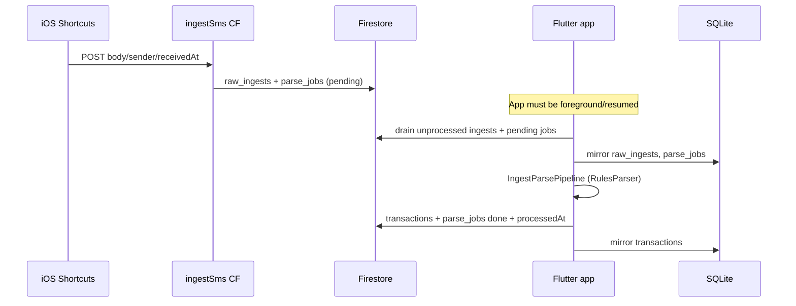
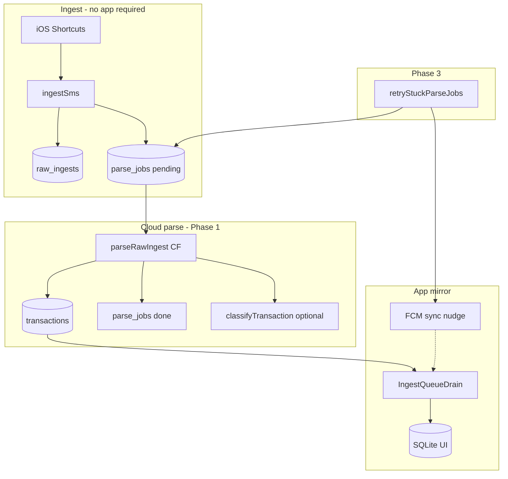

# Cloud background parse & sync

**Status:** Design (2026-06-03). Phase 3 maintenance function implemented; cloud rules parser not started.

## Question

Can Money Matters sync and parse SMS ingests in the background without opening the app?

**Short answer: partially yes.**

| Layer | Works today without app open? | Notes |
|-------|------------------------------|-------|
| SMS → cloud (`ingestSms`) | **Yes** | Shortcuts Message automation POSTs on arrival |
| Cloud → parse → ledger | **No** (client-only) | `IngestParsePipeline` runs on device |
| Cloud → device sync | **Only when app runs** | Hourly timer + resume + manual Recovery |
| True iOS background drain | **Unreliable** | BGTask, push, and Shortcuts schedules are all constrained |

The highest-leverage change is **Phase 1: parse in Cloud Functions** so the ledger is ready in Firestore before the app opens. Background app sync becomes a nice-to-have mirror step, not a prerequisite for parsing.

---

## Current architecture



### Existing Cloud Functions (`asia-south1`, Node 22)

| Function | Trigger | Role |
|----------|---------|------|
| `ingestSms` | HTTP POST | Auth + idempotency; creates queue |
| `classifyTransaction` | Callable | LLM category for ambiguous debits |
| `notifyClassification` | Firestore `transactions` onCreate | FCM “needs category” (optional) |
| `testLlmApiKey`, `fetchLlmModels` | Callable | Agent settings |
| `retryStuckParseJobs` | Scheduled (6 h) | **New** — nudge + mark stuck pending jobs |

### Client sync (commit `a9f62f8` pattern)

- `IngestQueueDrain` on launch, resume, tab focus, hourly `Timer.periodic`
- `FirestoreRealtimeSyncService` mirrors `transactions` into SQLite while app is alive
- Shortcut B (`moneymatters://recovery`) for manual sync

---

## iOS background feasibility (honest)

### What iOS allows

| Mechanism | Parse SMS? | Drain Firestore? | Reliability |
|-----------|------------|------------------|-------------|
| Shortcuts Message automation | N/A (POST only) | No | **High** for ingest |
| Shortcuts Time of Day automation | No | Can open app / URL | Low–medium; not sub-hourly |
| `BGAppRefreshTask` | No SMS access | Possible brief network | System decides; ~15 min+ gaps |
| `BGProcessingTask` | No SMS access | Longer network OK | Rare; user must enable Background App Refresh |
| FCM data/silent push | No | Wake app briefly | Needs paid Apple Developer + APNs; still not guaranteed |
| FCM notification tap | No | User opens app → resume drain | Works today if token registered |

**Hard constraint:** iOS never exposes SMS inbox APIs to background code. Shortcuts POST remains the only ingest path.

### Shortcuts “every N minutes” heartbeat

Personal automations **Time of Day** can run on an interval, but:

- Apple does not guarantee exact intervals (often coalesced to ~15–60+ minutes).
- Cannot run arbitrary HTTP in true background without showing UI in some iOS versions.
- Practical pattern: **Message trigger for ingest** (already built) + optional **Time of Day → Open URL `moneymatters://recovery`** as a coarse catch-up, not a parser.

Document limits in user-facing Shortcuts guide if we add a third automation.

---

## “Parse in the cloud” — what must be built

Porting `lib/parse/rules_parser.dart` (~500 lines) plus:

1. **Payment source matching** — read `users/{uid}/payment_sources` (sender hints, last4)
2. **Category rules** — read `users/{uid}/categories` merchant rules
3. **Transaction write** — same schema as `IngestParsePipeline._persistTransaction`
4. **Job completion** — set `parse_jobs.status = done`, `raw_ingests.processedAt`
5. **LLM gate (optional)** — reuse `classifyTransaction` internals for `needsClassification`

**Estimated effort:** 2–4 sessions (port parser + fixture parity with `test/parse/rules_parser_test.dart`, integration tests, dual-write migration).

**Alternative (not recommended):** LLM-only cloud parse — simpler code, higher cost/latency, worse privacy.

### Recommended trigger

Firestore **`onCreate`** on `users/{uid}/parse_jobs/{jobId}` where `status == pending`:

- Load `raw_ingests/{rawIngestId}`
- Run server rules parser
- Write `transactions/{rawIngestId}` (idempotent doc id = ingest key)
- Mark job done in same transaction

Using `parse_jobs` (not `raw_ingests`) avoids double-fire because ingest CF creates both atomically and the job is the work unit.

---

## “File store” — where parsed results live

| Store | Use in Money Matters | Recommendation |
|-------|---------------------|----------------|
| **Firestore `transactions`** | Source of truth when signed in; app already drains + realtime sync | **Primary** for cloud-parsed rows |
| **SQLite** | Offline-fast UI, local aggregates | Mirror only; populated on app open |
| **Cloud Storage** | Binary blobs | **Not** for structured transactions |
| **Server SQLite** | N/A | Do not introduce |

Cloud parse should write **Firestore `transactions`** only. The app’s existing drain + `FirestoreRealtimeSyncService` keeps SQLite current.

---

## Phased plan

### Phase 1 — Cloud rules parse (highest value)

```
parse_jobs onCreate → parseRawIngest CF → transactions + job done
```

- App open: drain sees `processedAt` set, pulls transactions, skips local parse for done jobs
- App closed: ledger still grows in Firestore; dashboard correct on next open
- Migration: feature flag `settings/sync.cloudParseEnabled`; client skips local parse when job already `done`

**Deploy:** new function + Firestore index; no app change required for read path (transactions already drained).

### Phase 2 — Push nudge on pending ingest

Extend `notifyClassification` pattern:

- On `parse_jobs` create (or Phase 1 failure), send FCM:
  ```json
  { "type": "ingest_sync", "rawIngestId": "..." }
  ```
- Notification body: “New bank SMS synced — tap to update ledger”
- Tap → app opens → existing `AppLifecycleState.resumed` drain runs
- **No new background entitlement required** for notification-tap path

Silent/data-only wake remains optional and needs paid APNs.

### Phase 3 — Scheduled stuck-job retry ✅ (implemented)

`retryStuckParseJobs` (every 6 h):

- Collection-group query: `parse_jobs` where `status == pending` and `updatedAt` older than 2 h
- Sets `stuckAt` once per job (idempotent)
- Sends FCM sync nudge per user (max 1 per run) if tokens exist
- Does **not** re-parse (until Phase 1 exists); unblocks users who never got push

Future: when Phase 1 lands, scheduled job can re-enqueue failed/stuck jobs.

### Phase 4 (optional) — Client BGTask

- Register `BGAppRefreshTask` to call `drainIfAuthenticated()` (~30 s budget)
- Best-effort; keep Phase 1 as real fix

---

## Target architecture (end state)



---

## Cost, battery, latency tradeoffs

| Approach | Latency to ledger | Battery | Firebase cost |
|----------|-------------------|---------|---------------|
| Today (client parse) | Until user opens app | Low (no background work) | Minimal CF; Firestore reads on drain |
| Phase 1 cloud parse | Seconds after SMS POST | **Zero on device** | +1 CF invocation/SMS; +1–2 Firestore writes |
| Phase 2 FCM nudge | Faster user awareness | Tiny (one notification) | FCM free tier |
| Phase 3 scheduled | 2–6 h for stuck detection | Zero | 4 CF runs/day + small queries |
| Shortcuts heartbeat | Depends on user schedule | None extra | Same as manual open |

Cloud parse adds ~₹0.01-scale cost per thousand SMS on Blaze (function + writes); dominated by LLM if misused.

---

## Verification checklist

1. POST test SMS via Shortcuts → `raw_ingests` + `parse_jobs pending`
2. After Phase 1: without opening app, `transactions` doc appears within ~30 s
3. Open app → dashboard shows new row (SQLite mirror)
4. Kill app, POST SMS, wait 2+ h → `stuckAt` set; FCM nudge if token present
5. `cd firebase/functions && npm test`

---

## Deploy (Phase 3 — current)

```bash
cd firebase
npm ci && npm run build
firebase deploy --only functions:retryStuckParseJobs,firestore:indexes
```

If Eventarc/IAM errors on other functions, deploy this function alone (HTTP/scheduled do not need Eventarc).

---

## Next implementation tasks

1. Port `RulesParser` to TypeScript with shared golden fixtures (JSON export from Dart tests)
2. Implement `parseRawIngest` Firestore trigger behind `CLOUD_PARSE_ENABLED` env
3. Client: skip local parse when `parse_jobs.status == done` before drain processes body
4. Optional Shortcuts doc: Time-of-Day “Sync now” automation limits
5. Optional `BGAppRefreshTask` wrapper in Flutter

See `docs/HANDOFF.md` for owner next steps.
