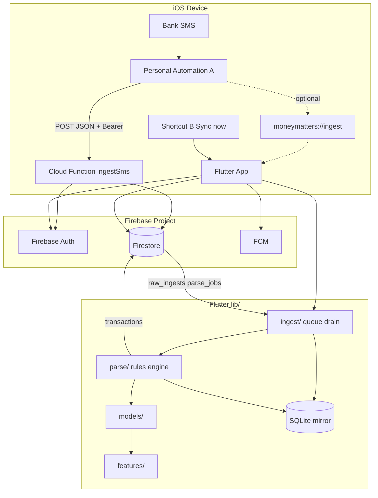
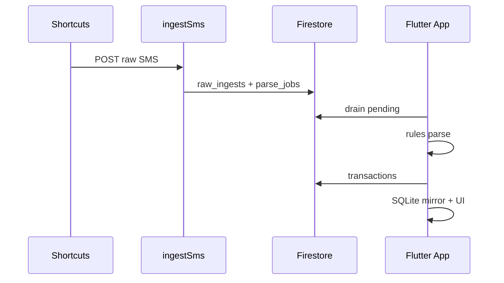

# Money Matters MVP — Build Plan

> **2026-05-31 production pass shipped:** false-positive hardening (loan/EMI/balance marketing rejected; verb + instrument context required), `unmatched` bucket excluded from dashboard totals, per-payment-source breakdown with drill-down + transaction detail, Firestore-backed reclassifiable categories (`users/{uid}/categories`), LLM `classifyTransaction` CF (Gemini, rules-first gate, `needsConfig` fallback), `notifyClassification` FCM trigger, and an in-app "Needs your input" inbox/badge that works without push. New tx fields: `type`, `needsClassification`, `merchantNormalized`, `userNotes`, `shoppingItems`, `classifiedBy`. See `docs/HANDOFF.md` for USER ACTIONS (Gemini key, function deploy, paid Apple account for real push).

## Problem frame

Personal iOS ledger: Shortcuts POST financial SMS to Firebase while the app is killed; Flutter drains, rules-parse, links payment sources, shows analytics. Stock iOS only — no inbox API, no Android. Architecture **S1 cloud-handoff-first** (see origin doc).

## MVP scope (from requirements)

| In scope | Out of scope (v1) |
|----------|-------------------|
| S1 POST → `ingestSms` → Firestore queue | Android, App Store, jailbreak |
| Keyword-filtered Shortcuts automations | On-device LLM (interface stub only) |
| Rules-first Indian bank SMS parser | Email ingest, local-only toggle |
| 2 banks + 2 cards onboarding | Sender allowlist per bank |
| Weekly/monthly dashboard | Full FCM production wiring (stub hooks OK) |
| Recovery: multi-paste, ingest status | Paid dev account polish beyond README note |

**Requirement traceability:** R1–R9 ingestion, R10–R13 parsing, R14–R19 sources/categories, R20–R22 UI, R23–R25 recovery.

---

## Architecture



**Data flow (happy path):**

1. Shortcuts POST → `ingestSms` validates Bearer, computes idempotency key, writes `raw_ingests` + `parse_jobs` (pending).
2. App launch → drain Firestore pending ingests → local SQLite mirror.
3. Parse worker (in-app) runs rules on each `RawIngest` → `Transaction` or skip (reminder/promo).
4. UI reads SQLite + Firestore sync for dashboard/review.

---

## Module boundaries and file ownership

**Rule:** Parallel agents MUST NOT edit files outside their stream. Shared integration files are owned by **Coordinator (Phase 3)** only.

| Stream | Owns | Must NOT touch |
|--------|------|----------------|
| **A — Firebase** | `firebase/`, `firestore.rules`, `firebase.json`, `functions/` | `lib/`, `ios/`, `android/`, `docs/shortcuts/` (except cross-ref in firebase README) |
| **B — Flutter foundation** | `pubspec.yaml`, `lib/main.dart`, `lib/core/**`, `lib/ingest/**`, `ios/Runner/Info.plist` (URL scheme), `ios/Runner.entitlements` (App Group placeholder), project bootstrap | `lib/models/**`, `lib/parse/**`, `lib/features/**`, `firebase/` |
| **C — Parser + models** | `lib/models/**`, `lib/parse/**`, `test/parse/**`, `test/models/**` | `lib/features/**`, `lib/ingest/**` (except importing public types), `firebase/`, `ios/` |
| **D — UI + Shortcuts docs** | `lib/features/**`, `docs/shortcuts/**`, `lib/app_router.dart` (if created here) | `lib/parse/**`, `lib/ingest/**` implementation, `firebase/` |

**Coordinator integration (Phase 3):** `lib/services/ingest_parse_pipeline.dart`, wire `main.dart` routes, fix import cycles, `README.md`, `docs/HANDOFF.md`.

---

## Firebase design

### Auth

- Firebase Auth: email/password or anonymous + link (MVP: **email/password** single user).
- On onboarding: create **device ingest token** — random 32-byte secret stored in Keychain; copy to Shortcuts as `Bearer <token>`.
- Cloud Function validates: `Authorization: Bearer <deviceIngestToken>` against `users/{uid}/device_tokens/{deviceId}` document.

### Firestore collections

| Collection | Doc ID | Fields (MVP) |
|------------|--------|----------------|
| `users` | `{uid}` | `email`, `createdAt`, `deviceIds[]` |
| `users/{uid}/device_tokens` | `{deviceId}` | `tokenHash` (sha256 of bearer), `createdAt`, `label` |
| `users/{uid}/payment_sources` | auto | `name`, `type` (bank\|card\|wallet), `last4`, `senderHints[]`, `createdAt` |
| `users/{uid}/raw_ingests` | `{idempotencyKey}` | `body`, `sender`, `receivedAt`, `deviceId`, `source`, `batchHint`, `createdAt`, `duplicate` |
| `users/{uid}/parse_jobs` | auto | `rawIngestId`, `status` (pending\|done\|failed), `rulesVersion`, `error`, `updatedAt` |
| `users/{uid}/transactions` | auto | `rawIngestId`, `amount`, `currency`, `merchant`, `timestamp`, `categoryId`, `paymentSourceId`, `unmatched`, `ambiguous`, `type` (debit\|credit) |
| `users/{uid}/categories` | auto or seed | `name`, `system` (bool), `merchantRules[]` |

**Queue drain pattern:** App queries `raw_ingests` where `processedAt == null` OR `parse_jobs` where `status == pending` (Firestore chosen over RTDB for structured queries and security rules).

### Cloud Function: `ingestSms`

**Route:** `POST https://<region>-<project>.cloudfunctions.net/ingestSms`

**Headers:**

- `Authorization: Bearer <deviceIngestToken>` (required)
- `Content-Type: application/json`

**Body (required fields):**

```json
{
  "body": "string",
  "sender": "string",
  "receivedAt": "ISO8601",
  "deviceId": "uuid",
  "source": "shortcuts-automation-v1",
  "batchHint": null
}
```

**Server logic:**

1. Verify Bearer → resolve `uid` from `device_tokens`.
2. Normalize: `senderNorm = trim(lower(sender))`, `bodyNorm = collapseWhitespace(body)`.
3. `minuteBucket = floorToMinute(receivedAt)` (use client `receivedAt`; server `createdAt` logged separately).
4. `idempotencyKey = sha256(senderNorm + "|" + bodyNorm + "|" + minuteBucket)`.
5. If `users/{uid}/raw_ingests/{idempotencyKey}` exists → `200 { "ok": true, "duplicate": true, "id": "<key>" }`.
6. Else transaction write: `raw_ingests` doc + `parse_jobs` doc (`status: pending`).
7. Return `201 { "ok": true, "duplicate": false, "id": "<key>" }`.

**Errors:** `401` invalid token, `400` validation, `500` internal.

### Security rules (sketch)

- `users/{uid}/**`: read/write if `request.auth.uid == uid`.
- `ingestSms` is HTTPS-only (Admin SDK in function); clients never write `raw_ingests` directly from Shortcuts.

### FCM (MVP stub)

- Document topic: unmatched/ambiguous → data message shape in `firebase/README.md`.
- App registers token in onboarding; handler stub in Stream D.

---

## Flutter design

### Bootstrap

```bash
cd "<repo-root>"
flutter create . --org com.moneymatters --project-name money_matters --platforms=ios
```

### `pubspec.yaml` dependencies

- `firebase_core`, `firebase_auth`, `cloud_firestore`, `firebase_messaging`
- `app_links` (URL scheme)
- `sqflite` + `path` (local mirror; drift optional later)
- `http` (health check / optional direct POST test)
- `intl`, `uuid`, `crypto` (idempotency client-side preview)

### Folder structure

```
lib/
  main.dart
  app_router.dart          # Coordinator may merge routes from D
  core/
    config/firebase_options.dart  # placeholder — user runs flutterfire configure
    auth/
    db/local_database.dart
    utils/normalize.dart
  models/                  # Stream C
  parse/                   # Stream C
  ingest/                  # Stream B
    ingest_repository.dart
    ingest_queue_drain.dart
    url_ingest_handler.dart
  features/                # Stream D
    onboarding/
    dashboard/
    review/
    recovery/
```

### iOS-only

- No `android/` folder in CI checks; `flutter build ios` for verify.
- `ios/Runner/Info.plist`: URL scheme `moneymatters`, `CFBundleURLTypes`.
- App Group: `group.com.moneymatters.shared` in entitlements (placeholder for S2).
- `GoogleService-Info.plist`: **not committed** — README instructs download from Firebase console.

### URL scheme (R4)

`moneymatters://ingest?body=...&sender=...&receivedAt=...` — truncate long body in query; POST remains source of truth.

---

## Shortcuts specification

### Automation A — Money Matters Ingest SMS

| Step | Action |
|------|--------|
| Trigger | Personal Automation → Message → **Message Contains** (OR multiple automations): `debited`, `credited`, `INR`, `Rs`, `spent`, `payment`, `UPI`, `card` |
| Run | **Run Immediately** |
| 1 | Get Shortcut Input → **Content** → variable `body` |
| 2 | Get Shortcut Input → **Sender** → variable `sender` |
| 3 | Current Date → ISO 8601 → `receivedAt` |
| 4 | Get Contents of URL — POST `INGEST_URL`, headers `Authorization: Bearer INGEST_TOKEN`, `Content-Type: application/json`, body JSON per contract |
| 5 | (Optional) Open URL `moneymatters://ingest?...` if app open |

**Export:** Document in `docs/shortcuts/setup.md` + JSON payload examples in `docs/shortcuts/payload-examples.json`. `.shortcut` binary export is manual from Shortcuts app — link placeholder in README.

### Shortcut B — Sync now

- Open App → `moneymatters://recovery` or navigate to Recovery screen.
- Does not fetch SMS history (R24).

---

## Integration sequence



| Step | Owner | Action |
|------|-------|--------|
| 1 | A | Deploy functions + rules; user sets `INGEST_URL`, token |
| 2 | B | `flutter pub get`, URL scheme, drain repository |
| 3 | C | Parser unit tests green |
| 4 | D | Onboarding stores token + deviceId for Shortcuts |
| 5 | Coordinator | `IngestParsePipeline`: drain → parse → persist |
| 6 | Coordinator | `flutter analyze`, `flutter test` |

### Verification commands

```bash
# Firebase (from firebase/)
npm ci && npm run build
firebase emulators:start --only functions,firestore   # optional local

# Flutter (from repo root)
flutter pub get
flutter analyze
flutter test

# iOS build (requires Xcode + plist)
flutter build ios --no-codesign
```

**Manual E2E:** curl POST to `ingestSms` with sample body from `docs/shortcuts/payload-examples.json`; launch app; confirm transaction on dashboard.

---

## Parallel stream deliverables

### Stream A — Firebase backend

- `firebase/functions/src/ingestSms.ts` (or `.js`)
- `firestore.rules`, `firebase.json`, `firebase/README.md`
- Seed script or docs for default categories

### Stream B — Flutter foundation + ingest

- iOS-only Flutter project
- `lib/ingest/`, `lib/core/db/`, `main.dart` shell
- URL handler + Firestore drain

### Stream C — Parser + domain models

- Models + rules engine + `LlmParser` interface (no-op)
- `test/parse/` with HDFC/ICICI-style fixtures

### Stream D — UI + Shortcuts docs

- Onboarding, dashboard, review, recovery screens
- `docs/shortcuts/setup.md`, payload examples
- `Info.plist` URL scheme (coordinate with B — **D owns feature routes; B owns plist URL registration**)

**Plist conflict resolution:** B owns `Info.plist` URL types; D documents only.

---

## User blockers (document in README)

| Blocker | User action |
|---------|-------------|
| Firebase project ID | Create project; run `flutterfire configure` |
| `GoogleService-Info.plist` | Download from Firebase console → `ios/Runner/` |
| `firebase_options.dart` | Generated by FlutterFire CLI |
| Ingest URL + Bearer token | Copy from app onboarding → Shortcuts |
| Apple Developer | Paid account recommended; free cert 7-day resign documented |
| Physical iPhone | Shortcuts automations do not run in Simulator reliably |

---

## Acceptance mapping (implementation check)

| AE | Verification |
|----|----------------|
| AE1–AE2 | Unit test idempotency + integration curl duplicate |
| AE3–AE4 | Parser tests in `test/parse/` |
| AE7 | Documented manual test with app killed |
| AE6 | Recovery screen paste test |

---

## References

- Requirements: `docs/brainstorms/money-matters-sms-ledger-requirements.md`
- Handoff: `docs/HANDOFF.md`
- Ideation: `docs/ideation/2026-05-29-money-matters-ios-shortcuts-ideation.md`
